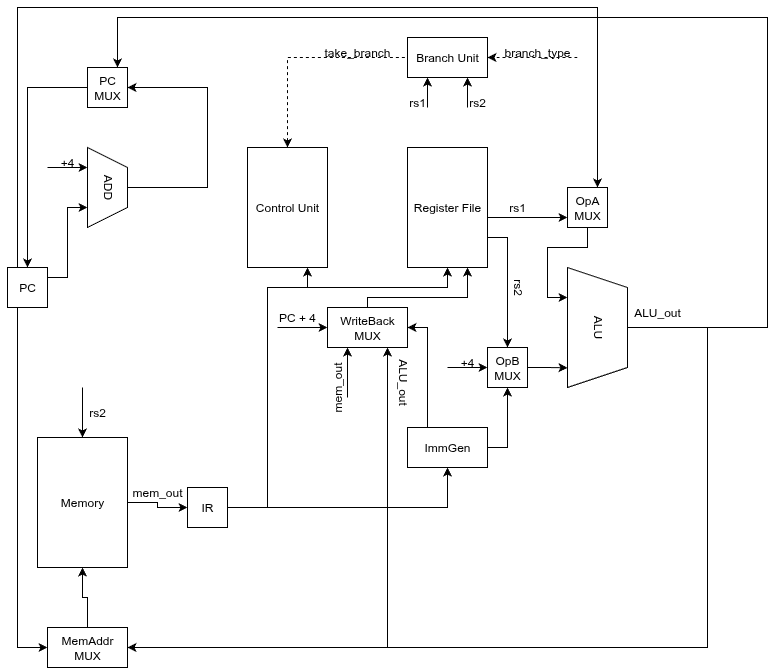
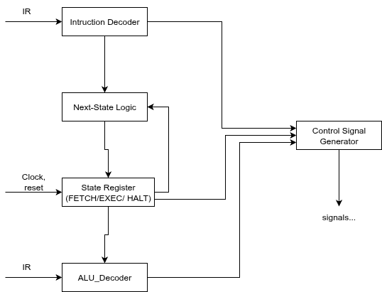

# Лабораторная работа №4. Эксперимент

- ФИО: **[Хоанг Тхе Вьет]**
- Группа: **[Р3232]**
- Вариант:

```text
lisp | risc | neum | hw | tick | binary | trap | mem | pstr | prob1 | vector
```

## Table of Contents

- [Язык программирования](#язык-программирования)
- [Организация памяти](#организация-памяти)
- [Система команд](#система-команд)
- [Транслятор](#транслятор)
- [Модель процессора](#модель-процессора)
- [Тестирование](#тестирование)
- [Текущее состояние и дальнейшее развитие](#текущее-состояние-и-дальнейшее-развитие)

---

## Язык программирования

### Общая характеристика

В проекте реализован минималистичный Lisp-подобный язык выражений. Язык выбран таким образом, чтобы:

- каждое вычисление было выражением;
- поддерживались рекурсивные функции;
- транслятор оставался простым и пригодным для лабораторной работы;
- семантика была достаточно строгой, чтобы программу можно было «выполнить на бумаге».

Язык поддерживает:

- числовые литералы;
- строковые литералы;
- булево истинное значение `t`;
- ложное значение `nil`;
- идентификаторы;
- `setq`, `if`, `begin`, `let`, `loop while ... do ... finally ...`;
- `print`, `read-char`, `read-line`, `halt`;
- вызовы пользовательских функций `defun`;
- набор встроенных операций: арифметика, сравнения, логические операции, побитовые операции и строковые builtins.

### Синтаксис (BNF)

Ниже приведена компактная форма синтаксиса текущего языка.

```bnf
<program> ::= { <top-form> }

<top-form> ::= <defun-form>
             | <expr>

<expr> ::= <number>
         | <string>
         | <boolean>
         | <nil>
         | <identifier>
         | <setq-form>
         | <if-form>
         | <begin-form>
         | <let-form>
         | <loop-form>
         | <print-form>
         | <read-char-form>
         | <read-line-form>
         | <halt-form>
         | <call-form>

<defun-form> ::= "(" "defun" <identifier> "(" [ <param-list> ] ")" <body> ")"
<param-list> ::= <identifier> { <identifier> }
<body> ::= <expr> { <expr> }

<setq-form> ::= "(" "setq" <identifier> <expr> ")"
<if-form> ::= "(" "if" <expr> <expr> <expr> ")"
<begin-form> ::= "(" "begin" <body> ")"
<let-form> ::= "(" "let" "(" [ <binding-list> ] ")" <body> ")"
<binding-list> ::= <binding> { <binding> }
<binding> ::= "(" <identifier> <expr> ")"
<loop-form> ::= "(" "loop" "while" <expr> "do" <body> "finally" <expr> ")"

<print-form> ::= "(" "print" <expr> ")"
<read-char-form> ::= "(" "read-char" ")"
<read-line-form> ::= "(" "read-line" ")"
<halt-form> ::= "(" "halt" ")"

<call-form> ::= "(" <callable> { <expr> } ")"
<callable> ::= <identifier>
             | <builtin-op>
```

### Семантика
#### Стратегия вычисления
- вычисление аргументов выполняется **слева направо**;
- язык использует **eager evaluation**;
- `if` вычисляет только одну нужную ветвь;
- `and` и `or` реализованы с **short-circuit** семантикой;
- `begin` вычисляет выражения последовательно и возвращает значение последнего выражения;
- `loop while ... do ... finally ...` рассматривается как выражение: после выхода из цикла вычисляется `finally`, и именно его значение становится значением всей конструкции.
#### Область видимости
- `let` создаёт **лексическую область видимости**;
- параметры функции также принадлежат лексической области видимости функции;
- глобальные переменные возникают по факту первого `setq` вне локального контекста.
#### Типы данных

В текущем состоянии проекта фактически используются следующие категории значений:
- 32-битные целые значения;
- подержка 64-битных чисел
- строки в формате Pascal string (`pstr`);
- булевы значения, сведённые к целым `1/0`;
- `nil` как `0`;
- адреса в памяти как обычные 32-битные значения.
### Пользовательские функции
Функции объявляются через `defun` и поддерживают рекурсию. Тело функции состоит из одного или нескольких выражений. Возвращаемым значением является значение последнего выражения тела.

Пример:

```lisp
(defun add_pair (x y)
  (let ((sum (+ x y)))
    sum))
```

---

## Организация памяти

### Общая модель

Архитектура варианта — **von Neumann**: программа работает в едином адресном пространстве, а модель памяти предоставляет доступ к разным логическим областям по адресам.

Текущая реализация использует:

- байтовую адресацию;
- машинное слово размером **32 бита = 4 байта**;
- фиксированную длину инструкции **32 бита**;
- проверку выравнивания для word access.

### Текущее разбиение адресного пространства

В исполняемом образе зафиксировано следующее расположение областей:

| Область | Базовый адрес | Назначение |
|---|---:|---|
| `.text`   | `0x0000_0000` | машинный код, код функций, runtime stubs |
| `.rodata` | `0x0001_0000` | зарезервировано под константы и неизменяемые данные |
| `.data`   | `0x0002_0000` | глобальные переменные, служебные runtime-данные, часть строковых данных в текущей реализации |
| `heap`    | `0x0003_0000` | динамически создаваемые `pstr`, в первую очередь результат `read-line` |
| `stack_top` | `0x000f_0000` | верхушка стека; стек растёт вниз |
| `mmio`    | `0x00ff_0000` | memory-mapped I/O |

Практически это означает, что модель уже отделяет код, данные, heap, stack и MMIO. Отдельного interrupt vector в текущей версии ещё нет, поэтому в отчёте он пока не описывается как реально используемая часть памяти.

### Регистры, доступные программисту

Скалярная часть использует набор регистров в стиле RISC-V:

- `x0` — постоянный ноль;
- `x1` (`ra`) — адрес возврата;
- `x2` (`sp`) — указатель стека;
- `x3` (`gp`) — база для глобальных данных;
- `x10..x17` (`a0..a7`) — аргументы и возвращаемое значение;
- `s`-регистры — сохраняемые регистры;
- `t`-регистры — временные.

### Размещение инструкций, процедур и данных

#### Инструкции и процедуры

- весь исполняемый код размещается в `.text`;
- пользовательские функции получают собственные метки `fn_<name>`;
- runtime-процедуры (печать числа, печать строки, чтение строки) также размещаются в `.text`.

#### Статические данные

Текущая реализация уже поддерживает:

- глобальные переменные через `.data`;
- служебные runtime-слоты, например указатель heap;
- строковые литералы в формате `pstr`.

**Замечание о текущем состоянии:**
логически под строковые литералы предусмотрен раздел `.rodata`, но в текущей реализации компилятор размещает строковые литералы в `.data`. Поэтому в реальном текущем состоянии `.rodata` может оставаться пустым. В отчёте это лучше проговорить явно, чтобы описание совпадало с исходным кодом.

#### Динамические данные

Heap предназначен для объектов, создаваемых во время исполнения. Сейчас основной реальный случай — результат `read-line`, который возвращает указатель на новую строку в heap.

#### Стек

Стек используется для:
- сохранения адреса возврата;
- сохранения предыдущей базы кадра;
- хранения локальных переменных;
- временного сохранения промежуточных значений при codegen;
- рекурсивных вызовов функций.
Стек растёт в сторону уменьшения адресов.

### Формат строк (`pstr`)

Строка хранится как последовательность слов:

```text
addr + 0  : length
addr + 4  : char[0]
addr + 8  : char[1]
...
```

Каждый символ хранится в одном 32-битном слове.

### Отображение объектов языка на память

#### Литералы и константы

- небольшие целые значения могут быть загружены непосредственно в регистр через `lui/addi`;
- строки сохраняются как `pstr` в статической памяти;
- в текущей реализации строковые литералы попадают в `.data`.

#### Переменные

- глобальные переменные получают именованные ячейки в `.data`;
- локальные переменные и параметры функции отображаются на frame slots в стеке;
- если значение нужно только кратковременно, codegen старается держать его во временных регистрах.

#### Процедуры

- каждая процедура имеет метку в `.text`;
- переход к процедуре выполняется через `jal`, возврат — через `jalr`.

#### Прерывания

- логика прерываний в текущей версии ещё не активна;

### MMIO

Вариант использует **memory-mapped I/O**. В текущей реализации предусмотрены следующие регистры:

| Смещение от `mmio_base` | Имя | Назначение |
|---|---|---|
| `0x00` | `IN_STATUS` | флаг наличия входных данных |
| `0x04` | `IN_DATA` | текущий входной символ |
| `0x08` | `OUT_DATA` | запись символа на вывод |
| `0x0c` | `OUT_STATUS` | состояние выходного устройства |
| `0x10` | `IRQ_ACK` | подтверждение чтения входных данных |


---

## Система команд

### Типы инструкций и их форматы

В ISA предусмотрены следующие форматы кодирования:

- **R-type**: операции над регистрами;
- **I-type**: immediate, load, `jalr`, CSR;
- **S-type**: store;
- **B-type**: условные переходы;
- **U-type**: загрузка верхней части константы;
- **J-type**: безусловный переход с сохранением адреса возврата.

### Набор инструкций

#### Реально исполняемые в текущей версии

#### Загрузка констант и адресов

| Инструкция | Формат | opcode | funct3 | funct7 / imm | Назначение |
|---|---|---|---|---|---|
| `lui rd, imm20` | U | `0110111` | — | `imm20` | загрузка верхних 20 бит константы в `rd` |
| `addi rd, rs1, imm12` | I | `0010011` | `000` | `imm12` | `rd = rs1 + imm12` |

#### Доступ к памяти

| Инструкция | Формат | opcode | funct3 | funct7 / imm | Назначение |
|---|---|---|---|---|---|
| `lw rd, off(rs1)` | I | `0000011` | `010` | `imm12` | чтение 1 word из памяти |
| `sw rs2, off(rs1)` | S | `0100011` | `010` | `imm[11:5] / imm[4:0]` | запись 1 word в память |

#### Скалярные ALU-операции

| Инструкция          | Формат | opcode    | funct3 | funct7    | Назначение                  |
| ------------------- | ------ | --------- | ------ | --------- | --------------------------- |
| `add rd, rs1, rs2`  | R      | `0110011` | `000`  | `0000000` | сложение                    |
| `sub rd, rs1, rs2`  | R      | `0110011` | `000`  | `0100000` | вычитание                   |
| `and rd, rs1, rs2`  | R      | `0110011` | `111`  | `0000000` | побитовое И                 |
| `or rd, rs1, rs2`   | R      | `0110011` | `110`  | `0000000` | побитовое ИЛИ               |
| `xor rd, rs1, rs2`  | R      | `0110011` | `100`  | `0000000` | побитовое XOR               |
| `sll rd, rs1, rs2`  | R      | `0110011` | `001`  | `0000000` | логический сдвиг влево      |
| `srl rd, rs1, rs2`  | R      | `0110011` | `101`  | `0000000` | логический сдвиг вправо     |
| `sra rd, rs1, rs2`  | R      | `0110011` | `101`  | `0100000` | арифметический сдвиг вправо |
| `slt rd, rs1, rs2`  | R      | `0110011` | `010`  | `0000000` | сравнение signed `<`        |
| `sltu rd, rs1, rs2` | R      | `0110011` | `011`  | `0000000` | сравнение unsigned `<`      |

#### Умножение и деление

| Инструкция | Формат | opcode | funct3 | funct7 | Назначение |
|---|---|---|---|---|---|
| `mul rd, rs1, rs2` | R | `0110011` | `000` | `0000001` | умножение, младшие 32 бита |
| `mulh rd, rs1, rs2` | R | `0110011` | `001` | `0000001` | старшие 32 бита signed × signed |
| `mulhsu rd, rs1, rs2` | R | `0110011` | `010` | `0000001` | старшие 32 бита signed × unsigned |
| `mulhu rd, rs1, rs2` | R | `0110011` | `011` | `0000001` | старшие 32 бита unsigned × unsigned |
| `div rd, rs1, rs2` | R | `0110011` | `100` | `0000001` | signed деление |
| `divu rd, rs1, rs2` | R | `0110011` | `101` | `0000001` | unsigned деление |
| `rem rd, rs1, rs2` | R | `0110011` | `110` | `0000001` | signed остаток |
| `remu rd, rs1, rs2` | R | `0110011` | `111` | `0000001` | unsigned остаток |

#### Управление потоком

| Инструкция | Формат | opcode | funct3 | funct7 / imm | Назначение |
|---|---|---|---|---|---|
| `beq rs1, rs2, off` | B | `1100011` | `000` | `imm13` | переход при равенстве |
| `bne rs1, rs2, off` | B | `1100011` | `001` | `imm13` | переход при неравенстве |
| `blt rs1, rs2, off` | B | `1100011` | `100` | `imm13` | signed `<` |
| `bge rs1, rs2, off` | B | `1100011` | `101` | `imm13` | signed `>=` |
| `jal rd, off` | J | `1101111` | — | `imm21` | безусловный переход и сохранение адреса возврата |
| `jalr rd, off(rs1)` | I | `1100111` | `000` | `imm12` | косвенный переход / возврат |

#### Остановка исполнения

| Инструкция | Формат    | opcode    | funct3 | funct7 / imm     | Назначение                  |
| ---------- | --------- | --------- | ------ | ---------------- | --------------------------- |
| `halt`     | I-special | `1110011` | `000`  | `imm12 = 0x0fff` | остановка модели процессора |


### Количество тактов

Для поддерживаемого scalar-базиса все инструкции завершаются за **2 такта**.

#### T1 — Fetch

- адрес в память подаётся из `PC`;
- из памяти считывается 32-битная инструкция;
- инструкция записывается в `IR`.

#### T2 — Execute / Memory / Writeback

На втором такте, в зависимости от инструкции, выполняются:

- чтение регистров;
- вычисление результата ALU;
- вычисление эффективного адреса;
- `lw/sw`;
- запись результата в регистр;
- выбор следующего `PC`.

---

## Транслятор

### Интерфейс командной строки

В текущем состоянии реализованы следующие CLI-команды:

```text
dump-image <input.bin>
sim-image <input.bin> [max_ticks]
dump-ast <input.lisp>
compile-lisp <input.lisp> <out.bin>
run-lisp <input.lisp> [max_ticks]
```

Назначение команд:

- `dump-image` — вывести сводку бинарного образа и listing;
- `sim-image` — исполнить уже собранный бинарный образ и вывести trace;
- `dump-ast` — распарсить исходник и вывести AST;
- `compile-lisp` — скомпилировать Lisp-программу в бинарный образ и `.lst`;
- `run-lisp` — выполнить полный конвейер: Lisp → asm/image → simulation.

### Общий механизм работы компилятора

Компилятор работает по следующей схеме:

1. исходный Lisp-файл токенизируется и парсится в AST;
2. собираются сигнатуры всех `defun`;
3. верхнеуровневые формы и функции по очереди преобразуются в внутреннее asm-представление;
4. по мере необходимости добавляются runtime-процедуры;
5. asm-программа разбивается по секциям `.text/.rodata/.data`;
6. assembler разрешает метки и формирует бинарные инструкции;
7. итог сериализуется в бинарный образ `AKIM`;
8. дополнительно генерируется listing-файл с адресами, байтами и мнемониками.

### Локальные кадры стека

Текущий пролог/эпилог устроен максимально просто:

- уменьшается `sp` на размер кадра + служебные слова;
- сохраняется `ra`;
- сохраняется старое значение frame-base;
- frame-base устанавливается в начало области локалов;
- в конце функции `ra` и frame-base восстанавливаются;
- возврат выполняется через `jalr`.

---

## Модель процессора

### Общая структура

Текущее состояние машины включает:
- 32 скалярных регистра;
- `pc`;
- `ir`;
- текущую фазу исполнения;
- счётчик тактов;
- флаг остановки и причину остановки;
- память;

### DataPath

**Ссылка на схему datapath:**





### Control Unit

**Ссылка на схему control unit:**





### Сигналы управления

Текущая hardwired control logic выбирает:

- источник `OpA` (`PC` или `rs1`);
- источник `OpB` (`rs2` или immediate);
- источник writeback (`ALU`, `MEM`, `PC+4`, upper immediate);
- способ выбора следующего `PC`;
- флаги чтения/записи памяти;
- необходимость записи в регистр;
- тип branch-сравнения;
- ALU-операцию.

Именно этот набор сигналов затем используется datapath-логикой на фазе `Execute`.

### Точность моделирования

Модель является **tick-accurate**. В текущей версии у неё две фазы:

- `Fetch`
- `Execute`

Таким образом, даже простейшая программа наблюдаемо идёт по тактам, а trace показывает отдельные состояния fetch и execute.

### Трассировка

Для каждого такта в журнал заносятся:

- номер такта;
- фаза (`fetch` / `execute`);
- `pc`;
- `ir`;
- декодированная мнемоника инструкции;
- краткая поясняющая заметка.

---

## Тестирование

### Как запускать тесты

Для проверки текущего состояния проекта достаточно запускать:

```bash
./run_test.sh
```


---

## Текущее состояние и дальнейшее развитие

### Что уже реализовано

На данный момент проект уже включает:

- scalar ISA с кодированием/декодированием;
- assembler layer с секциями, метками и listing;
- бинарный image format;
- machine state, memory subsystem и tick engine;
- hardwired scalar control + datapath execution;
- Lisp lexer/parser/AST;
- базовый компилятор выражений;
- вызовы функций, stack frame и рекурсию;
- runtime для `pstr`, `read-line`, `strlen`, `strget`, `strset`, печати.

То есть базовый scalar  уже собран в цельную цепочку:

```text
Lisp source -> AST -> asm program -> binary image -> machine simulation -> trace/output
```

### Что пока не завершено

В соответствии с текущим состоянием кода и milestone-планом, ещё не завершены:

- полноценный trap / interrupt / CSR execution path;
- interrupt scheduler по тактам;
- полноценная vector datapath/model;
- итоговые end-to-end golden tests в полном объёме варианта.

---

## Пример использования инструментальной цепочки

Построение бинарного образа:

```bash
cargo run -- compile-lisp examples/hello.lisp hello.bin
```

Просмотр AST:

```bash
cargo run -- dump-ast examples/hello.lisp
```

Запуск симуляции по исходнику:

```bash
cargo run -- run-lisp examples/hello.lisp 1000
```

Запуск симуляции по бинарному образу:

```bash
cargo run -- sim-image hello.bin 1000
```

Просмотр listing и структуры образа:

```bash
cargo run -- dump-image hello.bin
```
