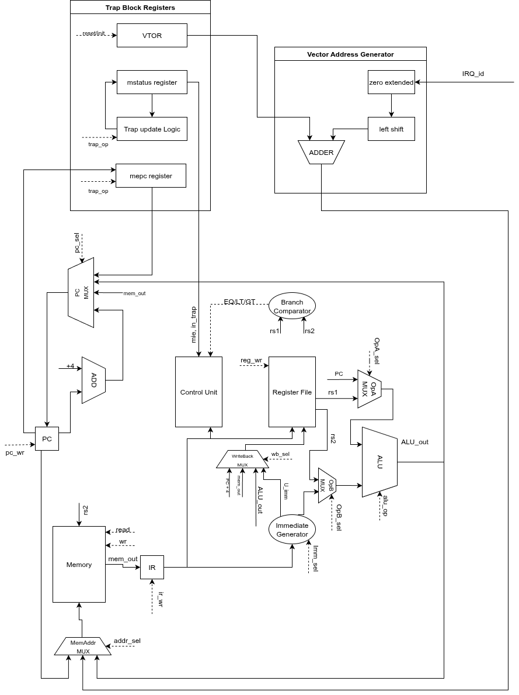
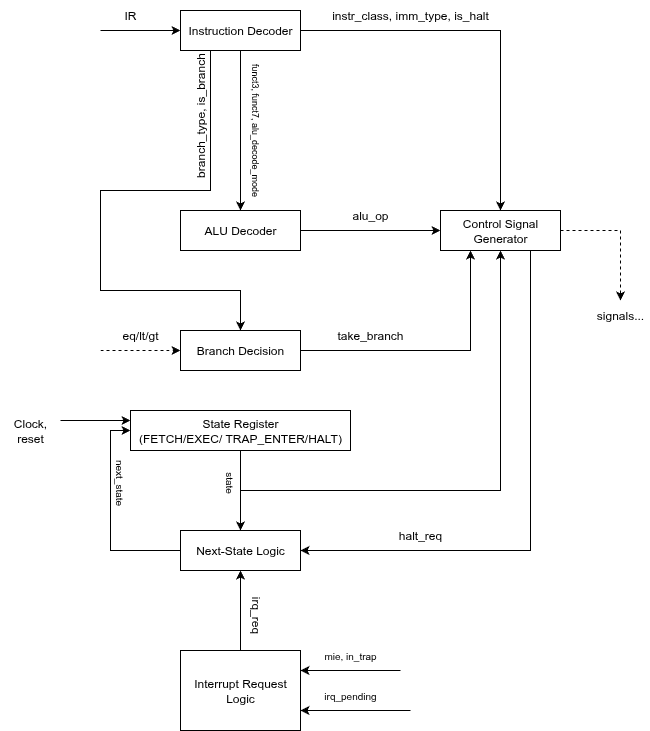

# Лабораторная работа №4. Эксперимент

- ФИО: **[Хоанг Тхе Вьет]**
- Группа: **[Р3232]**
- Вариант:

```text
lisp | risc | neum | hw | tick | binary | trap | mem | pstr | prob1 | vector
```

## Table of Contents

- [Язык программирования](#язык-программирования)
- [Организация памяти](#организация-памяти)
- [Система команд](#система-команд)
- [Система прерываний и trap](#система-прерываний-и-trap)
- [Транслятор](#транслятор)
- [Модель процессора](#модель-процессора)
- [Тестирование](#тестирование)
- [Пример использования инструментальной цепочки](#пример-использования-инструментальной-цепочки)

---

## Язык программирования

### Общая характеристика

В проекте реализован минималистичный Lisp-подобный язык выражений. Синтаксис основан на S-expression. Основная идея языка: почти все конструкции являются выражениями и возвращают значение.

Язык поддерживает:

- числовые литералы;
- строковые литералы;
- булево истинное значение `t`;
- ложное значение `nil`;
- идентификаторы;
- строгие аннотации типов для `defun`, `setq` и `let`;
- `if`, `begin`, `loop while ... do ... finally ...`;
- `print`, `print-str`;
- `read-char`, `read-line`;
- низкоуровневые trap-операции `read-input-data` и `handler-done`;
- `halt`;
- приведения типов `as-int`, `as-i64`, `as-bool`, `as-string`;
- рекурсивные пользовательские функции;
- арифметические, логические, побитовые и строковые встроенные операции.

### Синтаксис (BNF)

```bnf
<program> ::= { <top-form> }

<top-form> ::= <defun-form>
             | <expr>


<expr> ::= <number>
         | <string>
         | <boolean>
         | <nil>
         | <identifier>
         | <setq-form>
         | <if-form>
         | <begin-form>
         | <let-form>
         | <loop-form>
         | <print-form>
         | <print-str-form>
         | <read-char-form>
         | <read-line-form>
         | <read-input-data-form>
         | <handler-done-form>
         | <halt-form>
         | <cast-form>
         | <call-form>


<defun-form> ::= "(" "defun" <identifier> "(" [ <typed-param-list> ] ")" <type-name> <body> ")"

<typed-param-list> ::= <typed-param> { <typed-param> }

<typed-param> ::= "(" <identifier> <type-name> ")"

<body> ::= <expr> { <expr> }


<type-name> ::= ":int"
              | ":i64"
              | ":bool"
              | ":string"


<setq-form> ::= "(" "setq" <identifier> <type-name> <expr> ")"


<if-form> ::= "(" "if" <expr> <expr> <expr> ")"

<begin-form> ::= "(" "begin" <body> ")"


<let-form> ::= "(" "let" "(" [ <binding-list> ] ")" <body> ")"

<binding-list> ::= <binding> { <binding> }

<binding> ::= "(" <identifier> <type-name> <expr> ")"


<loop-form> ::= "(" "loop" "while" <expr> "do" <body> "finally" <expr> ")"


<print-form> ::= "(" "print" <expr> ")"

<print-str-form> ::= "(" "print-str" <expr> ")"


<read-char-form> ::= "(" "read-char" ")"

<read-line-form> ::= "(" "read-line" ")"

<read-input-data-form> ::= "(" "read-input-data" ")"

<handler-done-form> ::= "(" "handler-done" ")"


<halt-form> ::= "(" "halt" ")"


<cast-form> ::= "(" <cast-op> <expr> ")"

<cast-op> ::= "as-int"
            | "as-i64"
            | "as-bool"
            | "as-string"


<call-form> ::= "(" <callable> { <expr> } ")"

<callable> ::= <identifier>
             | <builtin-op>


<builtin-op> ::= "+"
               | "-"
               | "*"
               | "/"
               | "%"
               | "="
               | "!="
               | "<"
               | "<="
               | ">"
               | ">="
               | "and"
               | "or"
               | "not"
               | "bit-and"
               | "bit-or"
               | "bit-xor"
               | "shl"
               | "shr"
               | "sar"
               | "strlen"
               | "strget"
               | "strset"


<boolean> ::= "t"

<nil> ::= "nil"


<number> ::= <digit> { <digit> }
           | "-" <digit> { <digit> }


<string> ::= "\"" { <string-char> } "\""


<identifier> ::= <identifier-head> { <identifier-tail> }

<identifier-head> ::= <letter> | "_"

<identifier-tail> ::= <letter>
                    | <digit>
                    | "_"
                    | "-"
                    | "?"


<digit> ::= "0" | "1" | "2" | "3" | "4" | "5" | "6" | "7" | "8" | "9"

<letter> ::= "a" | "b" | "c" | ... | "z"
           | "A" | "B" | ... | "Z"

<string-char> ::= любой символ, кроме `"` и перевода строки
```

### Семантика

#### Стратегия вычисления

- аргументы вычисляются слева направо;
- язык использует eager evaluation;
- `if` вычисляет только выбранную ветвь;
- `and` и `or` имеют short-circuit семантику;
- `begin` вычисляет выражения последовательно и возвращает значение последнего выражения;
- `loop while ... do ... finally ...` является выражением: после выхода из цикла вычисляется `finally`, его значение становится значением всего цикла;
- тело функции возвращает значение последнего выражения.

#### Область видимости

- `let` создаёт лексическую область видимости;
- параметры функции находятся в лексической области видимости тела функции;
- верхнеуровневый `setq` создаёт глобальную переменную;
- локальный `setq` проверяет тип существующей переменной и не позволяет менять её тип.

#### Типы данных

Язык использует следующие типы:

| Тип | Назначение |
|---|---|
| `:int` | 32-битное целое значение |
| `:i64` | 64-битное целое значение, представляемое двумя 32-битными словами |
| `:bool` | булево значение; `t` кодируется как `1`, `nil` как `0` |
| `:string` | указатель на строку в формате `pstr` |

`nil` используется как ложное значение и как нулевое значение в truthy-контексте. Отдельного литерала `false` нет.

#### Пользовательские функции

Функция объявляется через `defun`. Параметры и возвращаемый тип задаются явно.

```lisp
(defun sum2 ((a :int) (b :int)) :int
  (+ a b))

(setq x :int (sum2 10 20))
(print x)
```

---

## Организация памяти

### Общая модель

Архитектура варианта — **von Neumann**: инструкции, данные, стек, heap, таблица векторов прерываний и MMIO находятся в едином адресном пространстве. В программной модели секции хранятся отдельно, но все обращения выполняются через адреса этого общего пространства.

Параметры памяти:

- байтовая адресация;
- машинное слово — 32 бита;
- инструкция — 32 бита;
- word access требует выравнивания по 4 байтам;
- ввод-вывод реализован через memory-mapped I/O.

### Разбиение адресного пространства

| Область | Базовый адрес | Назначение |
|---|---:|---|
| `.text` | `0x0000_0000` | таблица векторов trap, машинный код, функции, runtime-процедуры |
| `.rodata` | `0x0001_0000` | зарезервированная область для неизменяемых данных |
| `.data` | `0x0002_0000` | глобальные переменные, `pstr`-литералы, служебные runtime-слоты |
| `heap` | `0x0003_0000` | динамически создаваемые строки, например результат `read-line` |
| `stack_top` | `0x000f_0000` | начальная вершина стека; стек растёт вниз |
| `mmio` | `0x00ff_0000` | memory-mapped I/O регистры |

### Регистры

#### Скалярные регистры

| Регистр | Имя | Назначение |
|---:|---|---|
| `x0` | `zero` | всегда `0` |
| `x1` | `ra` | адрес возврата |
| `x2` | `sp` | указатель стека |
| `x3` | `gp` | база глобальных данных / runtime |
| `x4` | `tp` | зарезервирован под runtime / систему |
| `x5..x7` | `t0..t2` | временные регистры |
| `x8..x9` | `s0..s1` | сохраняемые регистры, frame-base |
| `x10..x17` | `a0..a7` | аргументы и возвращаемые значения |
| `x18..x27` | `s2..s11` | сохраняемые регистры |
| `x28..x31` | `t3..t6` | временные регистры |

#### Trap-регистры

| Регистр | Назначение |
|---|---|
| `mstatus` | состояние trap-механизма; содержит флаги `MIE` и `IN_TRAP` |
| `vtor` | base address таблицы векторов прерываний |
| `mepc` | адрес возврата после обработки trap |

#### Vector-регистры

В ISA зарезервированы vector-регистры `v0..v7`, каждый содержит 4 lane по 32 бита.

### Размещение объектов языка

```text
Единое адресное пространство машины

0x0000_0000
+--------------------------------------------------+
| .text                                            |
|                                                  |
| word 0 : trap vector table                       |
|          IRQ0 -> address of input handler        |
|                                                  |
| _start: main program entry                       |
|                                                  |
| fn_<name>: user functions                        |
|                                                  |
| __rt_print_int                                   |
| __rt_print_pstr                                  |
| __rt_read_char                                   |
| __rt_read_line                                   |
| __default_input_handler                          |
+--------------------------------------------------+
0x0001_0000
+--------------------------------------------------+
| .rodata                                          |
| reserved for read-only constants                 |
+--------------------------------------------------+
0x0002_0000
+--------------------------------------------------+
| .data                                            |
|                                                  |
| global variables                                 |
|                                                  |
| string literals as pstr                          |
|   +0 : length                                    |
|   +4 : char[0]                                   |
|   +8 : char[1]                                   |
|   ...                                            |
|                                                  |
| runtime slots                                    |
|   __rt_heap_ptr                                  |
|   __rt_input_buf_head                            |
|   __rt_input_buf_tail                            |
|   __rt_input_buf_data                            |
+--------------------------------------------------+
0x0003_0000
+--------------------------------------------------+
| heap                                             |
| dynamic pstr objects created by read-line        |
+--------------------------------------------------+

        ...

0x000f_0000
+--------------------------------------------------+
| stack_top                                        |
| stack grows downward                             |
| saved ra, frame-base, locals, temporaries        |
+--------------------------------------------------+

        ...

0x00ff_0000
+--------------------------------------------------+
| MMIO                                             |
| +0x00 : IN_STATUS                                |
| +0x04 : IN_DATA                                  |
| +0x08 : OUT_DATA                                 |
| +0x0c : OUT_STATUS                               |
| +0x10 : IRQ_ACK                                  |
+--------------------------------------------------+
```

### Формат строк `pstr`

Строка хранится как последовательность 32-битных слов:

```text
addr + 0  : length
addr + 4  : char[0]
addr + 8  : char[1]
...
```

Каждый символ занимает одно машинное слово. `length` хранит количество символов.

### MMIO

| Смещение от `mmio_base` | Имя | Доступ | Назначение |
|---:|---|---|---|
| `0x00` | `MMIO_IN_STATUS` | read-only | бит `HAS_DATA` показывает наличие входного байта |
| `0x04` | `MMIO_IN_DATA` | read-only | текущий входной байт |
| `0x08` | `MMIO_OUT_DATA` | write-only | запись младшего байта отправляет символ на вывод |
| `0x0c` | `MMIO_OUT_STATUS` | read-only | выходное устройство готово |
| `0x10` | `MMIO_IRQ_ACK` | write/read | запись ненулевого значения подтверждает обработку входного байта |

---

## Система команд

### Форматы инструкций

Все инструкции имеют длину 32 бита.

| Формат | Назначение |
|---|---|
| R | операции над регистрами |
| I | immediate, load, `jalr`, system-special |
| S | store |
| B | условные переходы |
| U | загрузка верхней части immediate |
| J | `jal` |
| Vector I/S | vector load/store, кодируются аналогично scalar I/S |
| Vector R | операции над vector-регистрами |

### Скалярные инструкции

#### Загрузка констант и адресов

| Инструкция | Формат | opcode | funct3 | funct7 / imm | Назначение |
|---|---|---|---|---|---|
| `lui rd, imm20` | U | `0110111` | — | `imm20` | `rd = imm20 << 12` |
| `addi rd, rs1, imm12` | I | `0010011` | `000` | `imm12` | `rd = rs1 + imm12` |

#### Доступ к памяти

| Инструкция | Формат | opcode | funct3 | Назначение |
|---|---|---|---|---|
| `lw rd, off(rs1)` | I | `0000011` | `010` | чтение 32-битного слова |
| `sw rs2, off(rs1)` | S | `0100011` | `010` | запись 32-битного слова |

#### ALU-операции

| Инструкция | Формат | opcode | funct3 | funct7 | Назначение |
|---|---|---|---|---|---|
| `add rd, rs1, rs2` | R | `0110011` | `000` | `0000000` | сложение |
| `sub rd, rs1, rs2` | R | `0110011` | `000` | `0100000` | вычитание |
| `and rd, rs1, rs2` | R | `0110011` | `111` | `0000000` | побитовое И |
| `or rd, rs1, rs2` | R | `0110011` | `110` | `0000000` | побитовое ИЛИ |
| `xor rd, rs1, rs2` | R | `0110011` | `100` | `0000000` | побитовое XOR |
| `sll rd, rs1, rs2` | R | `0110011` | `001` | `0000000` | логический сдвиг влево |
| `srl rd, rs1, rs2` | R | `0110011` | `101` | `0000000` | логический сдвиг вправо |
| `sra rd, rs1, rs2` | R | `0110011` | `101` | `0100000` | арифметический сдвиг вправо |
| `slt rd, rs1, rs2` | R | `0110011` | `010` | `0000000` | signed `<` |
| `sltu rd, rs1, rs2` | R | `0110011` | `011` | `0000000` | unsigned `<` |

#### Умножение и деление

| Инструкция | Формат | opcode | funct3 | funct7 | Назначение |
|---|---|---|---|---|---|
| `mul rd, rs1, rs2` | R | `0110011` | `000` | `0000001` | младшие 32 бита произведения |
| `mulh rd, rs1, rs2` | R | `0110011` | `001` | `0000001` | старшие 32 бита signed × signed |
| `mulhsu rd, rs1, rs2` | R | `0110011` | `010` | `0000001` | старшие 32 бита signed × unsigned |
| `mulhu rd, rs1, rs2` | R | `0110011` | `011` | `0000001` | старшие 32 бита unsigned × unsigned |
| `div rd, rs1, rs2` | R | `0110011` | `100` | `0000001` | signed деление |
| `divu rd, rs1, rs2` | R | `0110011` | `101` | `0000001` | unsigned деление |
| `rem rd, rs1, rs2` | R | `0110011` | `110` | `0000001` | signed остаток |
| `remu rd, rs1, rs2` | R | `0110011` | `111` | `0000001` | unsigned остаток |

#### Управление потоком

| Инструкция | Формат | opcode | funct3 | Назначение |
|---|---|---|---|---|
| `beq rs1, rs2, off` | B | `1100011` | `000` | переход, если `rs1 == rs2` |
| `bne rs1, rs2, off` | B | `1100011` | `001` | переход, если `rs1 != rs2` |
| `blt rs1, rs2, off` | B | `1100011` | `100` | signed `<` |
| `bge rs1, rs2, off` | B | `1100011` | `101` | signed `>=` |
| `jal rd, off` | J | `1101111` | — | переход и запись `PC + 4` в `rd` |
| `jalr rd, off(rs1)` | I | `1100111` | `000` | косвенный переход и запись `PC + 4` в `rd` |

#### System / trap

| Инструкция | Формат | opcode | funct3 | imm12 | Назначение |
|---|---|---|---|---:|---|
| `mret` | I-special | `1110011` | `000` | `0x302` | возврат из trap handler |
| `halt` | I-special | `1110011` | `000` | `0x0fff` | остановка модели процессора |

### Vector-инструкции ISA

Vector-инструкции имеют кодирование в ISA и могут быть декодированы. Их execute path зарезервирован для vector-расширения.

| Инструкция | Формат | opcode | funct3 | funct7 | Назначение |
|---|---|---|---|---|---|
| `vld vd, off(rs1)` | Vector I | `0000111` | `000` | — | загрузка vector-регистра |
| `vst vs, off(rs1)` | Vector S | `0100111` | `000` | — | запись vector-регистра |
| `vadd vd, vs1, vs2` | Vector R | `1010111` | `000` | `0000000` | lane-wise сложение |
| `vsub vd, vs1, vs2` | Vector R | `1010111` | `000` | `0100000` | lane-wise вычитание |
| `vmul vd, vs1, vs2` | Vector R | `1010111` | `001` | `0000001` | lane-wise умножение |
| `vdiv vd, vs1, vs2` | Vector R | `1010111` | `100` | `0000001` | lane-wise деление |
| `vcmpeq vd, vs1, vs2` | Vector R | `1010111` | `010` | `0000000` | lane-wise сравнение на равенство |

### Количество тактов

Скалярные инструкции исполняются за два такта:

#### T1 — Fetch

- `MemAddrMUX` выбирает `PC`;
- память читает 32-битное слово по адресу `PC`;
- значение записывается в `IR`;
- `PC + 4` вычисляется как подготовленное значение для следующего такта.

#### T2 — Execute

В зависимости от инструкции выполняются:

- чтение `rs1` / `rs2`;
- генерация immediate;
- выбор входов ALU;
- операция ALU;
- чтение или запись памяти;
- writeback в register file;
- выбор следующего `PC`.

`trap_enter` является отдельной фазой и занимает один такт. `mret` является обычной scalar-инструкцией и занимает два такта.

---

## Система прерываний и trap

### Общая идея

Вариант использует асинхронный ввод через trap. Внешнее input device читает schedule-файл вида:

```text
5 A
100 l
180 i
290 c
375 e
500 \n
```

В начале каждого такта устройство проверяет, должен ли в этот момент появиться входной байт. Если `MMIO_IN_DATA` свободен, байт помещается в MMIO и выставляется `irq_pending`. Если предыдущий байт ещё не подтверждён через `IRQ_ACK`, новый байт теряется и попадает в `lost_input`.

### Trap-регистры и флаги

| Элемент | Назначение |
|---|---|
| `mstatus.MIE` | разрешает вход в trap |
| `mstatus.IN_TRAP` | показывает, что процессор уже находится в handler |
| `vtor` | base address таблицы векторов trap |
| `mepc` | адрес инструкции, к которой надо вернуться после `mret` |
| `irq_pending` | внешний сигнал от устройства ввода |
| `irq_id` | номер источника прерывания; для input используется `0` |

Вход в trap разрешён только если:

```text
irq_pending && mstatus.MIE && !mstatus.IN_TRAP
```

### Последовательность обработки trap

1. Input device помещает байт в `MMIO_IN_DATA` и выставляет `irq_pending`.
2. На фазе `Execute` Control Unit проверяет `irq_pending`, `MIE` и `IN_TRAP`.
3. Текущая инструкция завершается обычным образом.
4. Следующим состоянием становится `TrapEnter`.
5. На фазе `TrapEnter` datapath вычисляет адрес вектора: `vtor + irq_id * 4`.
6. Из памяти читается адрес handler-а.
7. `mepc` получает текущий `PC`, то есть адрес возврата.
8. В `mstatus` устанавливается `IN_TRAP = 1`, а `MIE` сбрасывается в `0`.
9. `PC` получает адрес handler-а.
10. Handler читает `MMIO_IN_DATA`, затем записывает ненулевое значение в `MMIO_IRQ_ACK`.
11. При выполнении `mret` процессор восстанавливает `PC = mepc`, сбрасывает `IN_TRAP` и снова устанавливает `MIE = 1`.

### Default input handler

Если пользователь не объявил собственный handler с именем `__default_input_handler`, runtime добавляет default handler. Его задача:

- сохранить временные регистры;
- прочитать байт из `MMIO_IN_DATA`;
- подтвердить ввод через `MMIO_IRQ_ACK`;
- положить байт в программный input buffer;
- восстановить временные регистры;
- выполнить `mret`.

`read-char` читает байты из программного input buffer. Если buffer пуст, `read-char` ждёт до появления символа. `read-line` вызывает `read-char` до тех пор, пока не будет прочитан символ `\n`; после этого возвращается `pstr` без символа перевода строки.

### Пользовательский trap handler

Пользователь может определить собственный handler:

```lisp
(defun __default_input_handler () :int
  (begin
    (setq ch :int (read-input-data))
    (print ch)
    (handler-done)))
```

`read-input-data` компилируется в чтение `MMIO_IN_DATA`. `handler-done` компилируется в запись `1` в `MMIO_IRQ_ACK`. После тела пользовательского handler-а compiler добавляет восстановление контекста и `mret`.

---

## Транслятор

### Интерфейс командной строки

```text
dump-image <input.bin>
sim-image <input.bin> [schedule.txt] [max_ticks]
dump-ast <input.lisp>
compile-lisp <input.lisp> <out.bin>
run-lisp <input.lisp> [schedule.txt] [max_ticks]
```

Назначение команд:

- `dump-image` — вывести структуру бинарного образа и listing;
- `sim-image` — выполнить уже собранный бинарный образ;
- `dump-ast` — распарсить Lisp-файл и вывести AST;
- `compile-lisp` — скомпилировать Lisp в binary image и `.lst`;
- `run-lisp` — выполнить полный путь: Lisp → binary image → simulation.

Если после имени программы передан числовой аргумент, он трактуется как `max_ticks`. Если передан нечисловой аргумент, он трактуется как путь к schedule-файлу ввода.

### Этапы компиляции

1. Токенизация Lisp source.
2. Построение AST.
3. Проверка типов.
4. Сбор сигнатур функций.
5. Эмиссия trap vector table.
6. Компиляция top-level форм.
7. Компиляция пользовательских функций.
8. Добавление runtime-процедур.
9. Сборка `.text`, `.rodata`, `.data`.
10. Разрешение меток.
11. Кодирование инструкций в 32-битные слова.
12. Сериализация в binary image `AKIM`.
13. Генерация `.lst` listing-файла.

### Binary image

Binary image содержит:

- magic `AKIM`;
- версию формата;
- entry point;
- базовые адреса и размеры секций;
- bytes секции `.text`;
- bytes секции `.rodata`;
- bytes секции `.data`.

---

## Модель процессора

### Общая структура машины

Модель содержит:

- register file из 32 scalar-регистров;
- `PC`;
- `IR`;
- hardwired Control Unit state;
- счётчик тактов;
- флаг остановки и причину остановки;
- память;
- trap state;
- input device;
- interrupt lines.

### DataPath



Основные блоки datapath:

- `PC`;
- `IR`;
- register file;
- immediate generator;
- ALU;
- branch comparator;
- branch decision через Control Unit;
- `PC + 4` adder;
- memory address mux;
- writeback mux;
- PC mux;
- trap vector address generator;
- trap block registers.

### Control Unit



Control Unit является hardwired. Основные внутренние блоки:

- state register;
- instruction decoder;
- ALU decoder;
- branch decision logic;
- interrupt request logic;
- control signal generator;
- next state logic.

### Фазы работы

| Фаза | Назначение |
|---|---|
| `Fetch` | чтение инструкции по `PC` и запись в `IR` |
| `Execute` | выполнение инструкции, memory access, writeback, обновление `PC` |
| `TrapEnter` | вход в handler: чтение vector table, запись `mepc`, обновление `mstatus`, загрузка `PC` handler-а |
| `Halt` | остановка модели |

### Основные управляющие сигналы

| Сигнал | Назначение |
|---|---|
| `pc_wr` | разрешение записи в `PC` |
| `ir_wr` | разрешение записи в `IR` |
| `reg_wr` | разрешение записи в register file |
| `mem_rd` | чтение памяти |
| `mem_wr` | запись памяти |
| `halt_req` | запрос остановки |
| `trap_enter` | вход в trap |
| `trap_exit` | выход из trap через `mret` |
| `addr_sel` | выбор адреса памяти: `PC`, `ALU_out`, trap vector address |
| `opa_sel` | выбор первого операнда ALU: `PC` или `rs1` |
| `opb_sel` | выбор второго операнда ALU: `rs2` или immediate |
| `imm_sel` | тип immediate: I/S/B/U/J/None |
| `alu_op` | операция ALU |
| `wb_sel` | источник writeback: ALU, memory, `PC+4`, upper immediate |
| `pc_sel` | источник следующего `PC`: `PC+4`, ALU target, branch, trap vector, `mepc` |
| `take_branch` | результат branch decision |

### Точность моделирования

Модель является tick-accurate. Каждый вызов `step_tick` моделирует один такт. В начале такта обновляется input device, затем выполняется текущая фаза процессора.

### Трассировка

Trace содержит:

- номер такта;
- фазу;
- `PC`;
- `IR`;
- декодированную мнемонику;
- внутренние входы Control Unit;
- выходные control signals;
- действия datapath;
- события input device.

---

## Тестирование

### Запуск всех тестов

```bash
./run_test.sh
```

---

## Пример использования инструментальной цепочки

Построение бинарного образа:

```bash
cargo run -- compile-lisp examples/01_print_hello_world/01_hello.lisp examples/01_print_hello_world/01.bin
```

Просмотр AST:

```bash
cargo run -- dump-ast examples/01_print_hello_world/01_hello.lisp
```

Запуск симуляции по исходнику без input schedule:

```bash
cargo run -- run-lisp examples/01_print_hello_world/01_hello.lisp 100000
```

Запуск симуляции по исходнику с input schedule:

```bash
cargo run -- run-lisp examples/09_hello_user_name/09_hello_user_name.lisp examples/09_hello_user_name/input.txt 100000
```

Запуск симуляции по бинарному образу:

```bash
cargo run -- sim-image examples/01_print_hello_world/01.bin 100000
```

Запуск симуляции по бинарному образу с input schedule:

```bash
cargo run -- sim-image examples/09_hello_user_name/09.bin examples/09_hello_user_name/input.txt 100000
```

Просмотр listing и структуры образа:

```bash
cargo run -- dump-image examples/01_print_hello_world/01.bin
```
