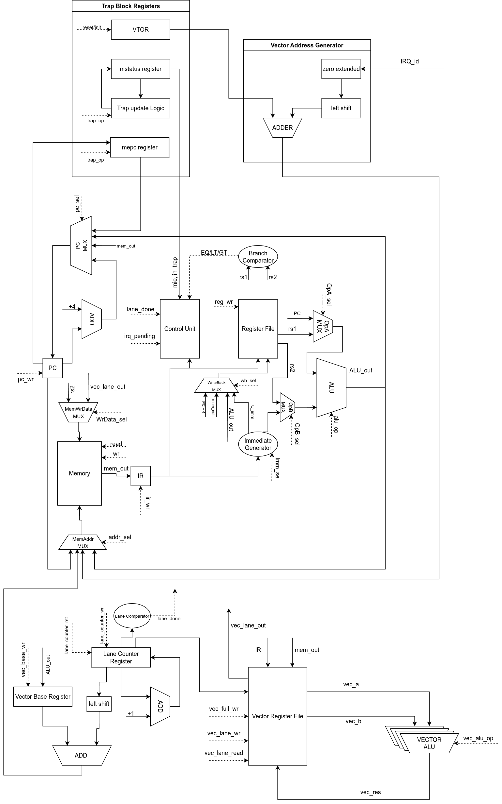
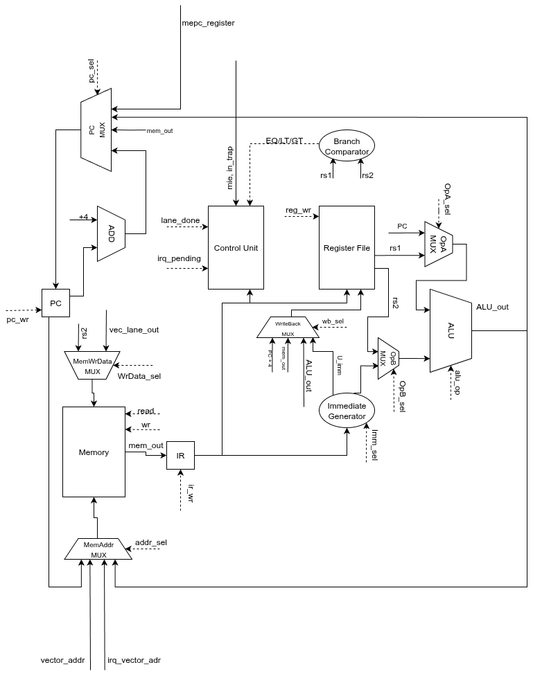
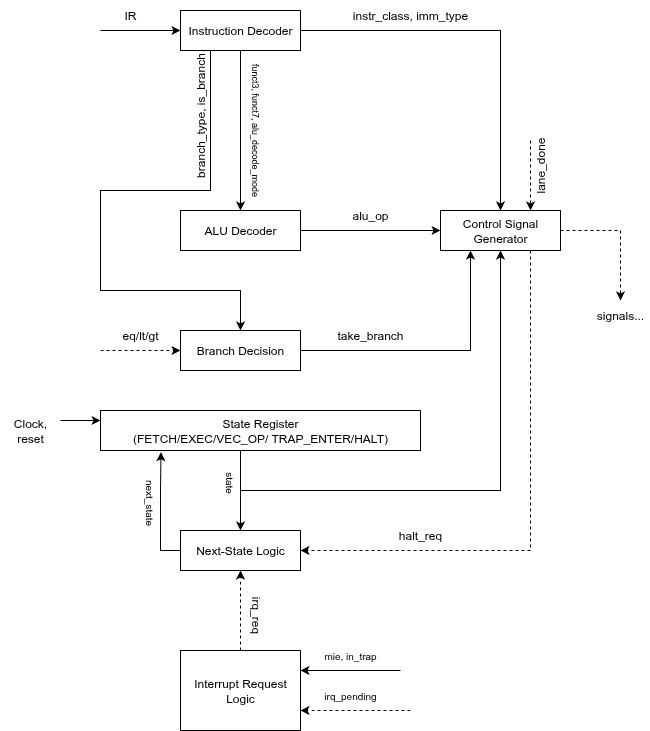

# Лабораторная работа №4. Эксперимент

- ФИО: **[Хоанг Тхе Вьет]**
- Группа: **[Р3232]**
- Вариант:

```text
lisp | risc | neum | hw | tick | binary | trap | mem | pstr | prob1 | vector
```

## Table of Contents

- [Язык программирования](#язык-программирования)
- [Организация памяти](#организация-памяти)
- [Система команд](#система-команд)
- [Система прерываний и trap](#система-прерываний-и-trap)
- [Vector extension](#vector-extension)
- [Транслятор](#транслятор)
- [Модель процессора](#модель-процессора)
- [Тестирование](#тестирование)
- [Пример использования инструментальной цепочки](#пример-использования-инструментальной-цепочки)

---

## Язык программирования

### Общая характеристика

В проекте реализован минималистичный Lisp-подобный язык выражений. Синтаксис основан на S-expression. Основная идея языка: почти все конструкции являются выражениями и возвращают значение.

Язык поддерживает:

- строгие аннотации типов для `defun`, `setq` и `let`;
- низкоуровневые trap-операции `read-input-data` и `handler-done`;
- `halt`;
- приведения типов `as-int`, `as-i64`;
- рекурсивные пользовательские функции;
- vector builtins `vadd`, `vsub`, `vmul`, `vdiv`, `vcmp`, работающие над массивами по 4 элемента за vector-step.

### Синтаксис (BNF)

```bnf
<program> ::= { <top-form> }

<top-form> ::= <defun-form>
             | <expr>


<expr> ::= <number>
         | <string>
         | <boolean>
         | <nil>
         | <identifier>
         | <setq-form>
         | <if-form>
         | <begin-form>
         | <let-form>
         | <loop-form>
         | <print-form>
         | <print-str-form>
         | <read-char-form>
         | <read-line-form>
         | <read-input-data-form>
         | <handler-done-form>
         | <halt-form>
         | <cast-form>
         | <call-form>


<defun-form> ::= "(" "defun" <identifier> "(" [ <typed-param-list> ] ")" <type-name> <body> ")"

<typed-param-list> ::= <typed-param> { <typed-param> }

<typed-param> ::= "(" <identifier> <type-name> ")"

<body> ::= <expr> { <expr> }


<type-name> ::= ":int"
              | ":i64"
              | ":bool"
              | ":string"
              | ":array"


<setq-form> ::= "(" "setq" <identifier> <type-name> <expr> ")"


<if-form> ::= "(" "if" <expr> <expr> <expr> ")"

<begin-form> ::= "(" "begin" <body> ")"


<let-form> ::= "(" "let" "(" [ <binding-list> ] ")" <body> ")"

<binding-list> ::= <binding> { <binding> }

<binding> ::= "(" <identifier> <type-name> <expr> ")"


<loop-form> ::= "(" "loop" "while" <expr> "do" <body> "finally" <expr> ")"


<print-form> ::= "(" "print" <expr> ")"

<print-str-form> ::= "(" "print-str" <expr> ")"


<read-char-form> ::= "(" "read-char" ")"

<read-line-form> ::= "(" "read-line" ")"

<read-input-data-form> ::= "(" "read-input-data" ")"

<handler-done-form> ::= "(" "handler-done" ")"


<halt-form> ::= "(" "halt" ")"


<cast-form> ::= "(" <cast-op> <expr> ")"

<cast-op> ::= "as-int"
            | "as-i64"


<call-form> ::= "(" <callable> { <expr> } ")"

<callable> ::= <identifier>
             | <builtin-op>


<builtin-op> ::= <arith-op>
               | <compare-op>
               | <logic-op>
               | <bit-op>
               | <array-op>
               | <vector-op>


<arith-op> ::= "+"
             | "-"
             | "*"
             | "/"
             | "%"


<compare-op> ::= "="
               | "!="
               | "<"
               | "<="
               | ">"
               | ">="


<logic-op> ::= "and"
             | "or"
             | "not"


<bit-op> ::= "bit-and"
           | "bit-or"
           | "bit-xor"
           | "shl"
           | "shr"
           | "sar"


<array-op> ::= "array"
             | "array-get"
             | "array-set"
             | "array-size"


<vector-op> ::= "vadd"
              | "vsub"
              | "vmul"
              | "vdiv"
              | "vcmp"


<boolean> ::= "t"

<nil> ::= "nil"


<number> ::= <digit> { <digit> }
           | "-" <digit> { <digit> }


<string> ::= "\"" { <string-char> | <escape-seq> } "\""

<escape-seq> ::= "\\n"
               | "\\t"
               | "\\r"
               | "\\\\"
               | "\\\""


<identifier> ::= <identifier-head> { <identifier-tail> }

<identifier-head> ::= <letter> | "_"

<identifier-tail> ::= <letter>
                    | <digit>
                    | "_"
                    | "-"
                    | "?"


<digit> ::= "0" | "1" | "2" | "3" | "4" | "5" | "6" | "7" | "8" | "9"

<letter> ::= "a" | "b" | "c" | ... | "z"
           | "A" | "B" | ... | "Z"

<string-char> ::= любой символ, кроме `"`, `\` и перевода строки
```

### Семантика

#### Стратегия вычисления

- аргументы вычисляются слева направо;
- язык использует eager evaluation;
- `if` вычисляет только выбранную ветвь;
- `and` и `or` имеют short-circuit семантику;
- `begin` вычисляет выражения последовательно и возвращает значение последнего выражения;
- `loop while ... do ... finally ...` является выражением: после выхода из цикла вычисляется `finally`, его значение становится значением всего цикла;
- тело функции возвращает значение последнего выражения.

#### Область видимости

- `let` создаёт лексическую область видимости;
- параметры функции находятся в лексической области видимости тела функции;
- верхнеуровневый `setq` создаёт глобальную переменную;
- локальный `setq` проверяет тип существующей переменной и не позволяет менять её тип.

#### Типы данных

Язык использует следующие типы:

| Тип | Назначение |
|---|---|
| `:int` | 32-битное целое значение |
| `:i64` | 64-битное целое значение, представляемое двумя 32-битными словами |
| `:bool` | булево значение; `t` кодируется как `1`, `nil` как `0` |
| `:string` | указатель на строку в формате `pstr` |
| `:array` | указатель на heap-массив 32-битных слов; используется обычными array builtins и vector builtins |

`nil` используется как ложное значение и как нулевое значение в truthy-контексте. Отдельного литерала `false` нет.

#### Пользовательские функции

Функция объявляется через `defun`. Параметры и возвращаемый тип задаются явно.

```lisp
(defun sum2 ((a :int) (b :int)) :int
  (+ a b))

(setq x :int (sum2 10 20))
(print x)
```

#### Массивы и vector builtins

Массив создаётся выражением `(array size)`. Оно возвращает значение типа `:array`. Все элементы массива — 32-битные слова. При создании массив заполняется нулями.

```lisp
(setq a :array (array 4))
(array-set a 0 10)
(array-set a 1 20)
(print (array-get a 1))
```

Операции над массивами:

| Операция | Аргументы | Результат | Семантика |
|---|---|---|---|
| `array` | `size :int` | `:array` | создать heap-массив размера `size` |
| `array-get` | `array :array`, `index :int` | `:int` | прочитать элемент |
| `array-set` | `array :array`, `index :int`, `value :int` | `:int` | записать элемент и вернуть записанное значение |
| `array-size` | `array :array` | `:int` | вернуть количество элементов |

Vector builtins принимают три массива: destination, left, right. Компилятор использует размер `left`-массива для цикла; в корректной программе `destination`, `left` и `right` должны иметь совместимый размер. Отдельная runtime-проверка совпадения размеров не выполняется. Возвращается destination array, поэтому результат можно использовать как обычное выражение.

| Операция | Семантика |
|---|---|
| `(vadd dst left right)` | `dst[i] = left[i] + right[i]` |
| `(vsub dst left right)` | `dst[i] = left[i] - right[i]` |
| `(vmul dst left right)` | `dst[i] = left[i] * right[i]` |
| `(vdiv dst left right)` | `dst[i] = left[i] / right[i]` как signed division |
| `(vcmp dst left right)` | `dst[i] = 1`, если `left[i] == right[i]`, иначе `0` |

Компилятор строит vector loop по 4 элемента и scalar tail для элементов, оставшихся после деления размера на 4.

```lisp
(setq a :array (array 5))
(setq b :array (array 5))
(setq c :array (array 5))

(array-set a 0 1)
(array-set a 1 2)
(array-set a 2 3)
(array-set a 3 4)
(array-set a 4 5)

(array-set b 0 10)
(array-set b 1 20)
(array-set b 2 30)
(array-set b 3 40)
(array-set b 4 50)

(vadd c a b)
(print (array-get c 0)) ; 11
(print (array-get c 4)) ; 55, scalar tail
```

---

## Организация памяти

### Общая модель

Архитектура варианта — **von Neumann**: инструкции, данные, стек, heap, таблица векторов прерываний и MMIO находятся в едином адресном пространстве. В программной модели секции хранятся отдельно, но все обращения выполняются через адреса этого общего пространства.

Параметры памяти:

- байтовая адресация;
- машинное слово — 32 бита;
- инструкция — 32 бита;
- word access требует выравнивания по 4 байтам;
- логическое адресное пространство составляет `2^32` байт, то есть 4 GiB;
- ввод-вывод реализован через memory-mapped I/O;
- vector load/store обращается к памяти по 32-битным lane, то есть каждый lane также требует word alignment.

### Разбиение адресного пространства

| Область | Базовый адрес | Назначение |
|---|---:|---|
| `.text` | `0x0000_0000` | таблица векторов trap, машинный код, функции, runtime-процедуры |
| `.data` | `0x0001_0000` | глобальные переменные, `pstr`-литералы, служебные runtime-слоты |
| `heap` | `0x0003_0000` | динамически создаваемые строки и массивы |
| `stack_top` | `0x000f_0000` | начальная вершина стека; стек растёт вниз |
| `mmio` | `0x00ff_0000` | memory-mapped I/O регистры |

### Регистры

#### Скалярные регистры

| Регистр | Имя | Назначение |
|---:|---|---|
| `x0` | `zero` | всегда `0` |
| `x1` | `ra` | адрес возврата |
| `x2` | `sp` | указатель стека |
| `x3` | `gp` | база глобальных данных / runtime |
| `x4` | `tp` | зарезервирован под runtime / систему |
| `x5..x7` | `t0..t2` | временные регистры |
| `x8..x9` | `s0..s1` | сохраняемые регистры, frame-base |
| `x10..x17` | `a0..a7` | аргументы и возвращаемые значения |
| `x18..x27` | `s2..s11` | сохраняемые регистры |
| `x28..x31` | `t3..t6` | временные регистры |

#### Trap-регистры

| Регистр | Назначение |
|---|---|
| `mstatus` | состояние trap-механизма; содержит флаги `MIE` и `IN_TRAP` |
| `vtor` | base address таблицы векторов прерываний |
| `mepc` | адрес возврата после обработки trap |

#### Vector-регистры

| Регистр | Размер | Назначение |
|---|---:|---|
| `v0..v7` | 4 lane × 32 бита | vector register file для vector load/store и lane-wise ALU операций |

Дополнительно в vector datapath используются служебные регистры и combinational-блоки:

| Регистр / блок           | Назначение                                           |
| ------------------------ | ---------------------------------------------------- |
| `VectorBaseRegister`     | базовый адрес текущего `vld` или `vst`               |
| `LaneCounterRegister`    | номер lane, который сейчас читается или записывается |
| `LaneOffsetShifter`      | вычисляет смещение lane: `lane * 4`                  |
| `VectorLaneAddressAdder` | вычисляет адрес текущего lane: `base + lane * 4`     |
| `LaneComparator`         | определяет, обработан ли последний lane              |

### Размещение объектов языка

```text
Единое адресное пространство машины

0x0000_0000
+--------------------------------------------------+
| .text                                            |
|                                                  |
| word 0 : trap vector table                       |
|          IRQ0 -> address of input handler        |
|                                                  |
| _start: main program entry                       |
|                                                  |
| fn_<name>: user functions                        |
|                                                  |
| generated vector loops for vadd/vsub/...         |
|                                                  |
| __rt_print_int                                   |
| __rt_print_pstr                                  |
| __rt_read_char                                   |
| __rt_read_line                                   |
| __default_input_handler                          |
+--------------------------------------------------+
0x0001_0000
+--------------------------------------------------+
| .data                                            |
|                                                  |
| global variables                                 |
|                                                  |
| string literals as pstr                          |
|   +0 : length                                    |
|   +4 : char[0]                                   |
|   +8 : char[1]                                   |
|   ...                                            |
|                                                  |
| runtime slots                                    |
|   __rt_heap_ptr                                  |
|   __rt_input_buf_head                            |
|   __rt_input_buf_tail                            |
|   __rt_input_buf_data                            |
+--------------------------------------------------+
0x0003_0000
+--------------------------------------------------+
| heap                                             |
| dynamic pstr objects created by read-line        |
| dynamic arrays created by array                  |
|   +0 : size                                      |
|   +4 : elem[0]                                   |
|   +8 : elem[1]                                   |
|   ...                                            |
+--------------------------------------------------+

        ...

0x000f_0000
+--------------------------------------------------+
| stack_top                                        |
| stack grows downward                             |
| saved ra, frame-base, locals, temporaries        |
+--------------------------------------------------+

        ...

0x00ff_0000
+--------------------------------------------------+
| MMIO                                             |
| +0x00 : IN_STATUS                                |
| +0x04 : IN_DATA                                  |
| +0x08 : OUT_DATA                                 |
| +0x0c : OUT_STATUS                               |
| +0x10 : IRQ_ACK                                  |
+--------------------------------------------------+
```

### Формат строк `pstr`

Строка хранится как последовательность 32-битных слов:

```text
addr + 0  : length
addr + 4  : char[0]
addr + 8  : char[1]
...
```

Каждый символ занимает одно машинное слово. `length` хранит количество символов.

### Формат массивов `:array`

Массив хранится в heap как последовательность 32-битных слов:

```text
addr + 0  : size
addr + 4  : elem[0]
addr + 8  : elem[1]
addr + 12 : elem[2]
addr + 16 : elem[3]
...
```

`array` выделяет блок в heap, записывает размер в первый word, затем обнуляет элементы. Heap pointer хранится в runtime-slot `__rt_heap_ptr` и сдвигается на `4 + size * 4` байт. `array-get` и `array-set` вычисляют адрес элемента как `array + 4 + index * 4`; отдельной runtime-проверки границ в текущем codegen нет.

### MMIO

| Смещение от `mmio_base` | Имя | Доступ | Назначение |
|---:|---|---|---|
| `0x00` | `MMIO_IN_STATUS` | read-only | бит `HAS_DATA` показывает наличие входного байта |
| `0x04` | `MMIO_IN_DATA` | read-only | текущий входной байт |
| `0x08` | `MMIO_OUT_DATA` | write-only | запись младшего байта отправляет символ на вывод |
| `0x0c` | `MMIO_OUT_STATUS` | read-only | выходное устройство готово |
| `0x10` | `MMIO_IRQ_ACK` | write/read | запись ненулевого значения подтверждает обработку входного байта |

---

## Система команд

### Форматы инструкций

Все инструкции имеют длину 32 бита.

| Формат | Назначение |
|---|---|
| R | операции над scalar-регистрами |
| I | immediate, load, `jalr`, system-special |
| S | store |
| B | условные переходы |
| U | загрузка верхней части immediate |
| J | `jal` |
| Vector I/S | vector load/store, кодируются аналогично scalar I/S |
| Vector R | операции над vector-регистрами |

### Скалярные инструкции

#### Загрузка констант и адресов

| Инструкция | Формат | opcode | funct3 | funct7 / imm | Назначение |
|---|---|---|---|---|---|
| `lui rd, imm20` | U | `0110111` | — | `imm20` | `rd = imm20 << 12` |
| `addi rd, rs1, imm12` | I | `0010011` | `000` | `imm12` | `rd = rs1 + imm12` |

#### Доступ к памяти

| Инструкция | Формат | opcode | funct3 | Назначение |
|---|---|---|---|---|
| `lw rd, off(rs1)` | I | `0000011` | `010` | чтение 32-битного слова |
| `sw rs2, off(rs1)` | S | `0100011` | `010` | запись 32-битного слова |

#### ALU-операции

| Инструкция | Формат | opcode | funct3 | funct7 | Назначение |
|---|---|---|---|---|---|
| `add rd, rs1, rs2` | R | `0110011` | `000` | `0000000` | сложение |
| `sub rd, rs1, rs2` | R | `0110011` | `000` | `0100000` | вычитание |
| `and rd, rs1, rs2` | R | `0110011` | `111` | `0000000` | побитовое И |
| `or rd, rs1, rs2` | R | `0110011` | `110` | `0000000` | побитовое ИЛИ |
| `xor rd, rs1, rs2` | R | `0110011` | `100` | `0000000` | побитовое XOR |
| `sll rd, rs1, rs2` | R | `0110011` | `001` | `0000000` | логический сдвиг влево |
| `srl rd, rs1, rs2` | R | `0110011` | `101` | `0000000` | логический сдвиг вправо |
| `sra rd, rs1, rs2` | R | `0110011` | `101` | `0100000` | арифметический сдвиг вправо |
| `slt rd, rs1, rs2` | R | `0110011` | `010` | `0000000` | signed `<` |
| `sltu rd, rs1, rs2` | R | `0110011` | `011` | `0000000` | unsigned `<` |

#### Умножение и деление

| Инструкция | Формат | opcode | funct3 | funct7 | Назначение |
|---|---|---|---|---|---|
| `mul rd, rs1, rs2` | R | `0110011` | `000` | `0000001` | младшие 32 бита произведения |
| `mulh rd, rs1, rs2` | R | `0110011` | `001` | `0000001` | старшие 32 бита signed × signed |
| `mulhsu rd, rs1, rs2` | R | `0110011` | `010` | `0000001` | старшие 32 бита signed × unsigned |
| `mulhu rd, rs1, rs2` | R | `0110011` | `011` | `0000001` | старшие 32 бита unsigned × unsigned |
| `div rd, rs1, rs2` | R | `0110011` | `100` | `0000001` | signed деление |
| `divu rd, rs1, rs2` | R | `0110011` | `101` | `0000001` | unsigned деление |
| `rem rd, rs1, rs2` | R | `0110011` | `110` | `0000001` | signed остаток |
| `remu rd, rs1, rs2` | R | `0110011` | `111` | `0000001` | unsigned остаток |

#### Управление потоком

| Инструкция | Формат | opcode | funct3 | Назначение |
|---|---|---|---|---|
| `beq rs1, rs2, off` | B | `1100011` | `000` | переход, если `rs1 == rs2` |
| `bne rs1, rs2, off` | B | `1100011` | `001` | переход, если `rs1 != rs2` |
| `blt rs1, rs2, off` | B | `1100011` | `100` | signed `<` |
| `bge rs1, rs2, off` | B | `1100011` | `101` | signed `>=` |
| `jal rd, off` | J | `1101111` | — | переход и запись `PC + 4` в `rd` |
| `jalr rd, off(rs1)` | I | `1100111` | `000` | косвенный переход и запись `PC + 4` в `rd` |

#### System / trap

| Инструкция | Формат | opcode | funct3 | imm12 | Назначение |
|---|---|---|---|---:|---|
| `mret` | I-special | `1110011` | `000` | `0x302` | возврат из trap handler |
| `halt` | I-special | `1110011` | `000` | `0x0fff` | остановка модели процессора |

### Vector-инструкции ISA

Vector-инструкции реализованы в ISA, декодере, Control Unit, DataPath и трассировке. Vector register file содержит `v0..v7`, каждый vector-регистр содержит 4 lane по 32 бита.

| Инструкция | Формат | opcode | funct3 | funct7 | Назначение |
|---|---|---|---|---|---|
| `vld vd, off(rs1)` | Vector I | `0000111` | `000` | — | загрузить 4 последовательных 32-битных слова из памяти в `vd` |
| `vst vs, off(rs1)` | Vector S | `0100111` | `000` | — | записать 4 lane из `vs` в память |
| `vadd vd, vs1, vs2` | Vector R | `1010111` | `000` | `0000000` | lane-wise сложение |
| `vsub vd, vs1, vs2` | Vector R | `1010111` | `000` | `0100000` | lane-wise вычитание |
| `vmul vd, vs1, vs2` | Vector R | `1010111` | `001` | `0000001` | lane-wise умножение |
| `vdiv vd, vs1, vs2` | Vector R | `1010111` | `100` | `0000001` | lane-wise signed деление |
| `vcmpeq vd, vs1, vs2` | Vector R | `1010111` | `010` | `0000000` | lane-wise сравнение на равенство; результат lane — `0` или `1` |

### Количество тактов

Модель является tick-accurate. Один вызов `step_tick` моделирует один такт. Fetch всегда занимает отдельный такт.

#### T1 — Fetch

- `MemAddrMUX` выбирает `PC`;
- память читает 32-битное слово по адресу `PC`;
- значение записывается в `IR`;
- `PC + 4` вычисляется как подготовленное значение для следующего такта.

#### T2 — Execute для scalar-инструкций

В зависимости от инструкции выполняются:

- чтение `rs1` / `rs2`;
- генерация immediate;
- выбор входов ALU;
- операция ALU;
- чтение или запись памяти;
- writeback в register file;
- выбор следующего `PC`.

Скалярные инструкции исполняются за два такта: `Fetch + Execute`.

#### Vector 

| Инструкция / фаза | Такты | Описание |
|---|---:|---|
| scalar `lui/addi/lw/sw/R/branch/jal/jalr/mret/halt` | 2 | `Fetch + Execute` |
| `VectorR` (`vadd/vsub/vmul/vdiv/vcmpeq`) | 2 | `Fetch + Execute`, VectorALU сразу считает все 4 lane |
| `vld` | 6 | `Fetch + Execute setup + 4 × VecOp lane read` |
| `vst` | 6 | `Fetch + Execute setup + 4 × VecOp lane write` |
| `trap_enter` | 1 | отдельная фаза после завершения инструкции или vector memory operation |

Для `vld` и `vst` фаза `Execute` не изменяет `PC`; она вычисляет base address и сбрасывает lane counter. Далее Control Unit переходит в `VecOp`. В каждом такте `VecOp` обрабатывается один lane. Тип операции (`vld` или `vst`) берётся из текущей инструкции в `IR`. После lane 3 счётчик очищается, `PC` получает `PC + 4`, и процессор возвращается к `Fetch` или переходит в `TrapEnter`, если ожидается interrupt.

---

## Система прерываний и trap

### Общая идея

Вариант использует асинхронный ввод через trap. Внешнее input device читает schedule-файл вида:

```text
5 A
100 l
180 i
290 c
375 e
500 \n
```

В начале каждого такта устройство проверяет, должен ли в этот момент появиться входной байт. Если `MMIO_IN_DATA` свободен, байт помещается в MMIO и выставляется `irq_pending`. Если предыдущий байт ещё не подтверждён через `IRQ_ACK`, новый байт теряется и попадает в `lost_input`.

### Trap-регистры и флаги

| Элемент | Назначение |
|---|---|
| `mstatus.MIE` | разрешает вход в trap |
| `mstatus.IN_TRAP` | показывает, что процессор уже находится в handler |
| `vtor` | base address таблицы векторов trap |
| `mepc` | адрес инструкции, к которой надо вернуться после `mret` |
| `irq_pending` | внешний сигнал от устройства ввода |
| `irq_id` | номер источника прерывания; для input используется `0` |

Вход в trap разрешён только если:

```text
irq_pending && mstatus.MIE && !mstatus.IN_TRAP
```

### Последовательность обработки trap

1. Input device помещает байт в `MMIO_IN_DATA` и выставляет `irq_pending`.
2. На фазе `Execute` Control Unit проверяет `irq_pending`, `MIE` и `IN_TRAP`.
3. Текущая инструкция завершается обычным образом.
4. Следующим состоянием становится `TrapEnter`.
5. На фазе `TrapEnter` datapath вычисляет адрес вектора: `vtor + irq_id * 4`.
6. Из памяти читается адрес handler-а.
7. `mepc` получает текущий `PC`, то есть адрес возврата.
8. В `mstatus` устанавливается `IN_TRAP = 1`, а `MIE` сбрасывается в `0`.
9. `PC` получает адрес handler-а.
10. Handler читает `MMIO_IN_DATA`, затем записывает ненулевое значение в `MMIO_IRQ_ACK`.
11. При выполнении `mret` процессор восстанавливает `PC = mepc`, сбрасывает `IN_TRAP` и снова устанавливает `MIE = 1`.

Если interrupt приходит во время `vld` или `vst`, Control Unit не прерывает середину vector memory operation. Запрос обслуживается после завершения последнего lane, чтобы состояние vector register file и памяти не осталось частично обновлённым с точки зрения инструкции.

### Default input handler

Если пользователь не объявил собственный handler с именем `__default_input_handler`, runtime добавляет default handler. Его задача:

- сохранить временные регистры;
- прочитать байт из `MMIO_IN_DATA`;
- подтвердить ввод через `MMIO_IRQ_ACK`;
- положить байт в программный input buffer;
- восстановить временные регистры;
- выполнить `mret`.

`read-char` читает байты из программного input buffer. Если buffer пуст, `read-char` ждёт до появления символа. `read-line` вызывает `read-char` до тех пор, пока не будет прочитан символ `\n`; после этого возвращается `pstr` без символа перевода строки.

### Пользовательский trap handler

Пользователь может определить собственный handler:

```lisp
(defun __default_input_handler () :int
  (begin
    (setq ch :int (read-input-data))
    (print ch)
    (handler-done)))
```

`read-input-data` компилируется в чтение `MMIO_IN_DATA`. `handler-done` компилируется в запись `1` в `MMIO_IRQ_ACK`. После тела пользовательского handler-а compiler добавляет восстановление контекста и `mret`.

---

## Vector extension

### Цель расширения

Vector extension добавляет аппаратную поддержку обработки массивов по 4 элемента за одну vector ALU operation и по одному lane за такт при vector load/store. На уровне языка это расширение не вводит отдельный тип `:vector`: программист работает с обычными `:array`, а компилятор сам генерирует инструкции `vld`, `vst` и `VectorR`.

### Программная модель

- vector-регистры: `v0..v7`;
- ширина vector-регистра: 4 lane × 32 бита;
- размер vector chunk: 16 байт;
- `vld`/`vst` работают с 4 последовательными 32-битными словами;
- vector ALU выполняет `vadd`, `vsub`, `vmul`, `vdiv`, `vcmpeq` сразу над четырьмя lane.

### Компиляция vector builtins

Для выражения:

```lisp
(vadd dst left right)
```

compiler генерирует следующий шаблон:

1. вычислить адреса `dst`, `left`, `right`;
2. прочитать размер `left`-массива;
3. сдвинуть указатели на первый элемент: `array_ptr + 4`;
4. вычислить количество vector-итераций: `size >> 2`;
5. вычислить количество оставшихся scalar-элементов: `size & 3`;
6. для каждой vector-итерации выполнить:
   - `vld v0, 0(left_ptr)`;
   - `vld v1, 0(right_ptr)`;
   - `vadd/vsub/vmul/vdiv/vcmpeq v2, v0, v1`;
   - `vst v2, 0(dst_ptr)`;
   - увеличить все указатели на 16 байт;
7. выполнить scalar tail loop для `size % 4` элементов;
8. вернуть `dst` как результат выражения.


## Сравнение scalar loop и vector extension


Для демонстрации преимущества vector extension были подготовлены две Lisp-программы, выполняющие одну и ту же задачу: сложение двух массивов из 9 элементов и сохранение результата в третий массив.  
  
Первая программа использует обычный scalar loop и обрабатывает элементы массива по одному. Вторая программа использует builtin `vadd`, который транслируется в vector-инструкции `vld`, `vadd`, `vst` для блоков по 4 элемента и scalar fallback для оставшихся элементов.

**По обычному:**
```lisp
(begin
  (let ((a :array (array 9))
        (b :array (array 9))
        (c :array (array 9))
        (i :int 0))

    (array-set a 0 1)
    (array-set a 1 2)
    (array-set a 2 3)
    (array-set a 3 4)
    (array-set a 4 5)
    (array-set a 5 6)
    (array-set a 6 7)
    (array-set a 7 8)
    (array-set a 8 9)

    (array-set b 0 10)
    (array-set b 1 20)
    (array-set b 2 30)
    (array-set b 3 40)
    (array-set b 4 50)
    (array-set b 5 60)
    (array-set b 6 70)
    (array-set b 7 80)
    (array-set b 8 90)

    (loop while (< i 9) do
      (array-set c i (+ (array-get a i) (array-get b i)))
      (setq i :int (+ i 1))
      finally c)
    (halt)))

```
**По вектору:**
``` lisp
(begin
  (let ((a :array (array 9))
        (b :array (array 9))
        (c :array (array 9)))

    (array-set a 0 1)
    (array-set a 1 2)
    (array-set a 2 3)
    (array-set a 3 4)
    (array-set a 4 5)
    (array-set a 5 6)
    (array-set a 6 7)
    (array-set a 7 8)
    (array-set a 8 9)

    (array-set b 0 10)
    (array-set b 1 20)
    (array-set b 2 30)
    (array-set b 3 40)
    (array-set b 4 50)
    (array-set b 5 60)
    (array-set b 6 70)
    (array-set b 7 80)
    (array-set b 8 90)

    (vadd c a b)

    (halt)))

```

**Сравнение:**

| Реализация              |     Instructions |       Ticks |
| ----------------------- | ---------------: | ----------: |
| Scalar loop, без `vadd` |              729 |        2394 |
| Vector `vadd`           |              682 |        1228 |
| Разница                 | -47 instructions | -1166 ticks |

Vector-реализация уменьшила размер машинного кода на 47 инструкций и сократила время исполнения на 1166 тактов. 
По числу тактов программа с `vadd` выполняется примерно в 1.95 раза быстрее, чем scalar loop.

---

## Транслятор

### Интерфейс командной строки

```text
sim-image <input.bin> [schedule.txt] [max_ticks] [brief|full]
compile-lisp <input.lisp> <out.bin>
run-lisp <input.lisp> [schedule.txt] [max_ticks] [brief|full]
```

Назначение команд:

- `sim-image` — выполнить уже собранный бинарный образ;
- `compile-lisp` — скомпилировать Lisp в binary image и `.lst`;
- `run-lisp` — выполнить полный путь: Lisp → binary image → simulation.

Если после имени программы передан числовой аргумент, он трактуется как `max_ticks`. Если передан нечисловой аргумент, он трактуется как путь к schedule-файлу ввода. Для `sim-image` и `run-lisp` дополнительно можно выбрать режим трассировки: `brief` или `full`. По умолчанию используется `brief`.


### Этапы компиляции

1. Токенизация Lisp source.
2. Построение AST.
3. Проверка типов.
4. Сбор сигнатур функций.
5. Эмиссия trap vector table.
6. Компиляция top-level форм.
7. Компиляция пользовательских функций.
8. Компиляция array/vector builtins в scalar/vector ISA.
9. Добавление runtime-процедур.
10. Сборка `.text` и `.data`.
11. Разрешение меток.
12. Кодирование инструкций в 32-битные слова.
13. Сериализация в binary image `AKIM`.
14. Генерация `.lst` listing-файла.

### Размещение переменных при компиляции

- Глобальный `setq` создаёт label в `.data`.
- Локальные переменные `let` и параметры функций размещаются в stack frame.
- Значения `:int`, `:bool`, `:string`, `:array` занимают одно 32-битное слово.
- Значение `:i64` занимает два 32-битных слова: low word и high word.
- Для временных значений используются `t0..t6`, `a0..a7` и stack spill через helper-ы `push_reg` / `pop_reg`.
- Аргументы функции передаются через `a0..a7`; `:i64` занимает два argument-word.

### Binary image

Binary image содержит:

- magic `AKIM`;
- версию формата;
- entry point;
- базовые адреса и размеры секций;
- bytes секции `.text`;
- bytes секции `.data`.

---

## Модель процессора

### Общая структура машины

Модель содержит:

- register file из 32 scalar-регистров;
- `PC`;
- `IR`;
- hardwired Control Unit state;
- счётчик тактов;
- флаг остановки и причину остановки;
- память;
- trap state;
- vector state;
- input device;
- interrupt lines.

### DataPath и Control Unit


### 1. Full DataPath



#### 2. Scalar DataPath



Scalar datapath содержит основную часть процессора, которая исполняет обычные RISC-инструкции без trap- и vector-расширений:

- `PC` и `IR`;
- `RegisterFile` для scalar-регистров `x0..x31`;
- `ImmGen` для I/S/B/U/J immediate;
- `OpA MUX` и `OpB MUX`;
- scalar `ALU`;
- `BranchComparator` и branch decision path;
- `PC + 4` adder;
- `MemoryBlock`;
- `MemAddr MUX`;
- `MemWriteData MUX`;
- `WriteBack MUX`;
- `PC MUX`.


#### 3. Trap extension


Trap extension добавляет к datapath:

- `mstatus` с флагами `MIE` и `IN_TRAP`;
- `vtor` — base address таблицы векторов;
- `mepc` — адрес возврата;
- `Trap Block`, вычисляющий `vtor + irq_id * 4`;
- входы `irq_pending` и `irq_id` от input device;


#### 4. Vector extension


Vector extension добавляет к datapath:

- `VectorRegisterFile` из `v0..v7`;
- `VectorALU` для lane-wise операций;
- `VectorBaseRegister`;
- `LaneCounterRegister`;
- `LaneOffsetShifter`, вычисляющий `lane * 4`;
- `LaneComparator`, определяющий последний lane;


#### 5. Control Unit



Control Unit является hardwired. Основные внутренние блоки:

- `StateRegister`;
- `InstructionDecoder`;
- `AluDecoder`;
- `BranchDecision`;
- `InterruptRequestLogic`;
- `ControlSignalGenerator`;
- `NextStateLogic`.


### Фазы работы

| Фаза        | Назначение                                                                                                      |
| ----------- | --------------------------------------------------------------------------------------------------------------- |
| `Fetch`     | чтение инструкции по `PC` и запись в `IR`                                                                       |
| `Execute`   | выполнение scalar-инструкции, setup vector memory operation, VectorR, memory access, writeback, обновление `PC` |
| `VecOp`     | lane-by-lane выполнение `vld` или `vst`                                                                         |
| `TrapEnter` | вход в handler: чтение vector table, запись `mepc`, обновление `mstatus`, загрузка `PC` handler-а               |
| `Halt`      | остановка модели                                                                                                |

### Основные управляющие сигналы на схемах

| Сигнал                 | Назначение                                                                                             |
| ---------------------- | ------------------------------------------------------------------------------------------------------ |
| `pc_wr`                | разрешение записи нового значения в `PC`                                                               |
| `ir_wr`                | разрешение записи инструкции из `mem_out` в `IR`                                                       |
| `reg_wr`               | разрешение записи в scalar `Register File`                                                             |
| `read`                 | разрешение чтения из памяти                                                                            |
| `wr`                   | разрешение записи в память                                                                             |
| `addr_sel`             | выбор источника адреса для `MemAddr MUX`: `PC`, `ALU_out`, trap vector address или vector lane address |
| `WrData_sel`           | выбор данных для записи в память: `rs2` или `vec_lane_out`                                             |
| `wb_sel`               | выбор источника scalar writeback: `ALU_out`, `mem_out`, `PC+4` или `U-imm`                             |
| `pc_sel`               | выбор следующего значения `PC`: `PC+4`, `ALU_out`, trap handler address или `mepc`                     |
| `OpA_sel`              | выбор первого операнда scalar ALU: `PC` или `rs1`                                                      |
| `OpB_sel`              | выбор второго операнда scalar ALU: `rs2` или immediate                                                 |
| `imm_sel` / `imm_type` | выбор типа immediate для `Immediate Generator`: `I`, `S`, `B`, `U`, `J` или `None`                     |
| `alu_op`               | выбор операции scalar ALU                                                                              |
| `trap_op`              | управление trap-блоком: вход в trap или выход через `mret`                                             |
| `vec_base_wr`          | разрешение записи `ALU_out` в `Vector Base Register`                                                   |
| `lane_counter_rst`     | сброс `Lane Counter Register` перед началом `vld`/`vst`                                                |
| `lane_counter_wr`      | разрешение обновления `Lane Counter Register` после обработки lane                                     |
| `vec_lane_wr`          | разрешение записи одного lane из `mem_out` в `Vector Register File`, используется в `vld`              |
| `vec_lane_read`        | разрешение чтения одного lane из `Vector Register File` в `vec_lane_out`, используется в `vst`         |
| `vec_full_wr`          | разрешение записи полного vector-регистра результатом `VectorALU`, используется в `VectorR`            |
| `vec_alu_op`           | выбор операции `VectorALU`: `vadd`, `vsub`, `vmul`, `vdiv`, `vcmpeq`                                   |
| `take_branch`          | результат `Branch Decision`, используется Control Unit для выбора следующего `PC`                      |
| `halt_req`             | запрос перехода процессора в состояние `HALT`                                                          |
| `irq_req`              | запрос входа в trap, формируется `Interrupt Request Logic`                                             |
| `irq_pending`          | входной сигнал: есть ожидающее прерывание от устройства                                                |
| `mie`                  | входной флаг из `mstatus`: разрешены прерывания                                                        |
| `in_trap`              | входной флаг из `mstatus`: процессор уже находится в trap handler                                      |
| `lane_done`            | результат `Lane Comparator`: обработан последний lane vector memory operation                          |
| `EQ/LT/GT`             | флаги `Branch Comparator` для условных переходов                                                       |
| `branch_type`          | тип branch-инструкции для `Branch Decision`                                                            |
| `is_branch`            | признак того, что текущая инструкция является branch                                                   |
| `instr_class`          | класс декодированной инструкции для `Control Signal Generator`                                         |
| `funct3`, `funct7`     | поля инструкции, используемые `ALU Decoder`                                                            |
| `alu_decode_info`      | информация из декодера инструкции для выбора операции ALU                                              |
| `state`                | текущее состояние `State Register`: `FETCH`, `EXEC`, `VEC_OP`, `TRAP_ENTER`, `HALT`                    |
| `next_state`           | следующее состояние, вычисленное `Next-State Logic`                                                    |


### Точность моделирования

Модель является tick-accurate. Каждый вызов `step_tick` моделирует один такт. В начале такта обновляется input device, затем выполняется текущая фаза процессора.

### Трассировка

Trace содержит:

- номер такта;
- фазу;
- `PC`;
- `IR`;
- декодированную мнемонику;
- внутренние входы Control Unit;
- выходные control signals;
- действия datapath;
- события input device.

Есть два режима:

- `brief` — компактная трасса с tags: `input`, `out`, `ack`, `trap`, `vector`, `mret`, `branch=taken`, `halt`;
- `full` — подробная трасса с `CU/in`, `CU/out` и действиями datapath.

---

## Тестирование

### Запуск всех тестов

```bash
./run_test.sh
```


---

## Пример использования инструментальной цепочки

Построение бинарного образа:

```bash
cargo run -- compile-lisp examples/01_print_hello_world/01_hello.lisp examples/01_print_hello_world/01.bin
```


Запуск симуляции по исходнику без input schedule:

```bash
cargo run -- run-lisp examples/01_print_hello_world/01_hello.lisp 100000
```

Запуск симуляции по исходнику с input schedule:

```bash
cargo run -- run-lisp examples/09_hello_user_name/09_hello_user_name.lisp examples/09_hello_user_name/input.txt 100000
```

Запуск симуляции по исходнику с подробной трассой:

```bash
cargo run -- run-lisp examples/09_hello_user_name/09_hello_user_name.lisp examples/09_hello_user_name/input.txt 100000 full
```

Запуск симуляции по бинарному образу:

```bash
cargo run -- sim-image examples/01_print_hello_world/01.bin 100000
```

Запуск симуляции по бинарному образу с input schedule:

```bash
cargo run -- sim-image examples/09_hello_user_name/09.bin examples/09_hello_user_name/input.txt 100000
```
